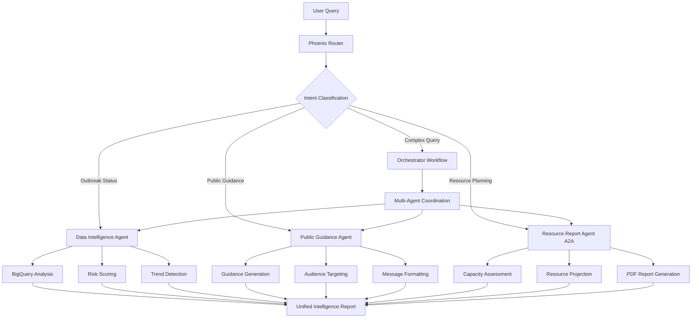

# Phoenix Outbreak Intelligence System Architecture

## Multi-Agent System Overview

Phoenix Outbreak Intelligence operates as a coordinated multi-agent system with specialized AI agents working together to provide comprehensive outbreak intelligence and response planning.



## Agent Responsibilities

### 1. Data Intelligence Agent
- **Purpose**: Real-time outbreak detection and risk assessment
- **Data Sources**: BigQuery public health datasets, CDC data, WHO data
- **Capabilities**:
  - Time series analysis and trend detection
  - Multi-factor risk scoring (cases, positivity, hospital capacity)
  - Anomaly detection and outbreak probability calculation
  - Rumor validation via MCP Web Reader

### 2. Public Guidance Agent
- **Purpose**: Convert complex data into clear, actionable public health guidance
- **Capabilities**:
  - Audience-specific messaging (general public, schools, businesses)
  - Risk-appropriate recommendations
  - Multi-channel communication formatting
  - Compliance with CDC/WHO guidelines

### 3. Resource Report Agent (A2A)
- **Purpose**: Healthcare resource planning and allocation
- **Deployment**: Cloud Run microservice
- **Capabilities**:
  - ICU/hospital bed capacity forecasting
  - PPE consumption modeling and procurement planning
  - Cost analysis and funding recommendations
  - Geographic optimization using Google Maps API
  - PDF report generation with visualizations

### 4. Orchestrator
- **Purpose**: Coordinate multi-agent workflows and route user requests
- **Components**:
  - **Router**: Intent classification and request routing
  - **Workflow**: Multi-agent coordination and execution
- **Capabilities**:
  - Natural language understanding
  - Complex query decomposition
  - Multi-agent result synthesis

## Technology Stack

### Core Framework
- **Google Agent Development Kit (ADK)**: Primary agent framework
- **Model Context Protocol (MCP)**: Tool integration
- **Vertex AI**: LLM and ML services
- **Cloud Run**: A2A agent deployment

### Data Layer
- **BigQuery**: Public health datasets
- **Cloud Storage**: Report and data archival
- **Cloud SQL**: Facility and resource databases

### Integration Layer
- **MCP Web Reader**: Web scraping and validation
- **Google Maps API**: Geographic analysis and routing
- **Cloud Functions**: Event-driven processing

### Monitoring & Operations
- **Cloud Monitoring**: Performance tracking
- **Cloud Logging**: Audit trails
- **Cloud Trace**: Request tracing
- **Prometheus**: Custom metrics

## Workflow Patterns

### Simple Query Pattern
```
User Input → Router → Single Agent → Response
```
- Used for: Simple information requests, single-domain queries
- Examples: "Risk level in California", "Travel guidance for Texas"

### Multi-Agent Pattern
```
User Input → Router → Orchestrator → Multiple Agents → Synthesis → Response
```
- Used for: Complex analysis, comprehensive reports
- Examples: "Complete outbreak assessment", "Emergency response plan"

### Emergency Response Pattern
```
Alert Trigger → All Agents (Parallel) → Priority Synthesis → Immediate Response
```
- Used for: Critical outbreak detection, emergency situations
- Features: Parallel processing, priority handling, immediate notifications

## Data Flow

### Input Data Sources
1. **Real-time Health Data**
   - CDC datasets (COVID-19, Influenza, syndromic surveillance)
   - State health department APIs
   - Hospital capacity feeds

2. **Geographic Data**
   - County/state boundaries
   - Population demographics
   - Healthcare facility locations

3. **External Intelligence**
   - News and social media (via MCP Web Reader)
   - Academic publications
   - Government announcements

### Processing Pipeline
1. **Data Ingestion**: Scheduled BigQuery updates
2. **Quality Assessment**: Data completeness and timeliness checks
3. **Analysis**: Statistical modeling and trend analysis
4. **Risk Scoring**: Multi-factor risk calculation
5. **Guidance Generation**: Evidence-based recommendations
6. **Resource Planning**: Capacity modeling and procurement planning

### Output Formats
- **Interactive Dashboard**: Real-time status and trends
- **Executive Reports**: PDF summaries for decision makers
- **Public Messaging**: Audience-specific guidance
- **API Responses**: Structured data for integration

## Scalability Architecture

### Horizontal Scaling
- **Agent Instances**: Auto-scaling based on demand
- **Cloud Run**: Serverless scaling for A2A agents
- **BigQuery**: Massively parallel query processing

### Geographic Distribution
- **Multi-region Deployment**: Low-latency global coverage
- **Data Locality**: Regional data processing
- **Edge Caching**: Fast response for common queries

### Performance Optimization
- **Query Caching**: Reduced BigQuery costs
- **Result Memoization**: Faster repeated analysis
- **Async Processing**: Non-blocking workflows

## Security & Compliance

### Data Protection
- **Encryption**: At rest and in transit
- **Access Controls**: IAM and service accounts
- **Audit Logging**: Complete audit trail

### Privacy Compliance
- **HIPAA Alignment**: Healthcare data handling
- **Public Data Only**: No personal health information
- **Data Retention**: Automated cleanup policies

### Operational Security
- **Network Security**: VPC and firewall rules
- **Secret Management**: Cloud Secret Manager
- **Vulnerability Scanning**: Automated security checks

## Deployment Strategy

### Development Environment
```bash
# Local ADK development
adk web

# Local agent testing
python -m pytest tests/
```

### Staging Environment
```bash
# Deploy to staging
adk deploy agent_engine agents/orchestrator --env=staging
```

### Production Environment
```bash
# Deploy orchestrator
adk deploy agent_engine agents/orchestrator --env=production

# Deploy A2A agent
sh deployment/deploy_A2A_agent.sh --env=production
```

## Monitoring & Alerting

### Key Metrics
- **Response Time**: Agent processing latency
- **Accuracy**: Risk score confidence levels
- **Availability**: System uptime and error rates
- **Data Freshness**: Time since last update

### Alert Conditions
- **High Risk Detection**: Automatic notification
- **System Errors**: Operational alerts
- **Data Staleness**: Quality alerts
- **Resource Shortages**: Capacity alerts

## Future Enhancements

### Phase 2 Capabilities
- **Predictive Modeling**: Machine learning forecasting
- **Real-time Dashboards**: Live visualization
- **Mobile Integration**: Native mobile apps
- **International Data**: Global outbreak tracking

### Advanced Features
- **Multi-language Support**: Localized guidance
- **Voice Interface**: Audio queries and responses
- **AR/VR Visualization**: Immersive data exploration
- **Automated Interventions**: Direct system integration